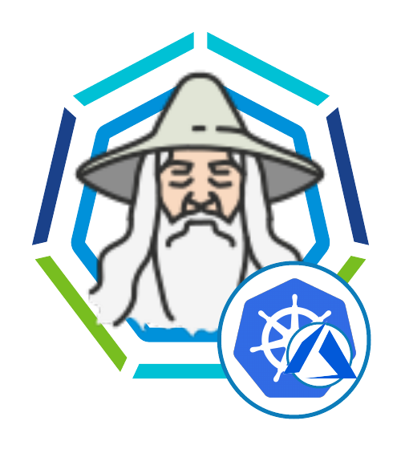

# Tanzu Kubernetes Grid Wizard for TKGm on Azure



**The aim is to simplify and provide a smooth user experience with TKGm.**

The official documentation of Tanzu Kubernetes Grid (https://docs.vmware.com/en/VMware-Tanzu-Kubernetes-Grid/1.3/vmware-tanzu-kubernetes-grid-13/GUID-index.html) contains a detailed way of provisioning management and workload clusters which requires several plugins installed lots for file manipulations and files may conflict if they are not organised properly.

This docker container is a bootstrapped way for achieving the same but a lot simpler. eg: You don't need to install anything on your host machine. Infact, you dont need to install anything. This bootstrapped docker taked care of it. It also helps with organised the files location. eg: Per management cluster and all of its workload cluster you can have one instance of this docker.


## Pre-Requisites

### Host machine
You need to have docker-ce or docker-ee on host machine.

### Download and install necessary binaries

Official documentation: 
https://docs.vmware.com/en/VMware-Tanzu-Kubernetes-Grid/1.3/vmware-tanzu-kubernetes-grid-13/GUID-install-cli.html

Steps:
- login into https://my.vmware.com
- then go to https://my.vmware.com/en/group/vmware/downloads/info/slug/infrastructure_operations_management/vmware_tanzu_kubernetes_grid/1_x
- Navigate to "Go to downloads" for Tanzu Kubernetes Grid
- 1 file to download
    - Download VMware Tanzu CLI for Linux
        - then `mv ~/Downloads/tanzu-cli-bundle-v1.x.x-linux-amd64.tar binaries/tanzu-cli-bundle-linux-amd64.tar`


### input using .env

Below are the values required:
- AZ_TENANT_ID={search 'tenant properties' in portal to get the azure tenant id}
- AZ_TKG_APP_ID={APP_ID is also known as CLIENT_ID. in portal search 'app registration' > New Regitration. the process is documented here: https://docs.vmware.com/en/VMware-Tanzu-Kubernetes-Grid/1.3/vmware-tanzu-kubernetes-grid-13/GUID-mgmt-clusters-azure.html#register-tanzu-kubernetes-grid-as-an-azure-client-app-3 }
- AZ_TKG_APP_CLIENT_SECRET={recorded secret from the above}
- AZ_SUBSCRIPTION_ID={azure subscription id}
- TKG_PLAN={default: `k8s-1dot20dot4-ubuntu-2004` --> as this was the latest at the time of writing this. Modify it to the version your prefer, notice how it is 1dot20dot4 instead of 1.20.4. Follow the same. IMPORTANT: In Tanzu Kubernetes Grid v1.3.1, the default cluster image --plan value is k8s-1dot20dot4-ubuntu-2004, based on Kubernetes version 1.20.4 and the machine OS, Ubuntu 20.04. Run the following command} 
- TKR_VERSION={default `v1.20.4---vmware.3-tkg.1`. This value is used for workload cluster creation using tkgworkloadwizard.sh. After you provision the management cluster you can get updated value by running `tanzu kubernetes-release get` and picking a version that is compatible=true and upgradable=true. Also adjust the `TKG_PLAN` according to the TKR you pick. ***Without right TKR and TKG_PLAN combo you will run into this error `ResourcePurchaseValidationFailed" Message="User failed validation to purchase resources. Error message: 'You have not accepted the legal terms on this subscription: 'xxxxx-xxx-xxx-000-203384034nho' for this plan. Before the subscription can be used, you need to accept the legal terms of the image.`*** }
- TKG_ADMIN_EMAIL={this email address will be needed for private and public key purpose. Nothing will be emailed to this address. Just signature purpose stuff.}


## Docker

```
docker build . -t tkgonazure
docker run -it --rm --net=host -v ${PWD}:/root/ -v /var/run/docker.sock:/var/run/docker.sock --name tkgonazure tkgonazure /bin/bash
```

***When run the first time (.env is not marked as COMPLETE eg: does not have COMPLETE=yes) it automatically goes initiates  management cluster creation.***

***When run 2nd or more times (.env is marked as COMPLETE eg: .env file contains COMPLETE=yes) it given shell access where you can execute tanzu commands***

**When prompted for keygen do the below:**
- when promted for filename press 'enter'. to keep the file name as id_rsa
- when prompted for password provide a password you like. and reconfirm the password. Providing no password will generate clear text which is a security issue.


Yes, I am using --net=host ---> 
- since this is only a bootstrapped container scalability is not of concern 
- since I will only run this to provision tkgm on azure and only on my localmachine or a jump vm security is not of concern 

# That's it for creating Tanzu Management Cluster on Azure

Simple enough with this bootstrapped docker.


# Create workload clusters on Azure using Tanzu

The official documentation here: https://docs.vmware.com/en/VMware-Tanzu-Kubernetes-Grid/1.3/vmware-tanzu-kubernetes-grid-13/GUID-tanzu-k8s-clusters-deploy.html

***Using this boostrapped docker when you get shell access you can use it to create workload clusters using tanzu cli OR tkgworkloadwizard on azure*** 

## Workload creation Wizard:


There are 2 ways to use the wizard:
- the `-f` flag: Create your own configfile and supply the location here. (as per documented here: https://docs.vmware.com/en/VMware-Tanzu-Kubernetes-Grid/1.3/vmware-tanzu-kubernetes-grid-13/GUID-tanzu-k8s-clusters-azure.html). You can add an additional parameter called `TMC_ATTACH_URL` in the config file for attaching the cluster to tmc. The `tmc attach` is a special addition to this docker.
- the `-n` flag: This will instruct the wizard to go into a wizard/guided mode and generate the config file and install the k8s cluster with user input and prompts. 

***For intermidiate level users tkgworkloadwizard -n is highly recommended.***

Once you get shell access to the docker container, follow the below steps

- run `tanzu kubernetes-release get` to get the Tanzu Kubernetes Release Version (eg: v1.20.4---vmware.3-tkg.1) and record a compatible=true and upgradable=true version. Fill the value in .env file for `TKR_VERSION` field. Also adjust the `TKG_PLAN` according to the TKR you pick. 
- Exit the docker (`exit`) and enter again by running `docker run -it --rm --net=host -v ${PWD}:/root/ -v /var/run/docker.sock:/var/run/docker.sock --name tkgonazure tkgonazure /bin/bash`. This is to reload the new value in environment variable context.
- `~/binaries/tkgworkloadwizard.sh -n name-of-workload-k8s-cluster`
- The wizard will handle most of the config generation based on the config from management cluster (eg: Azure login, subscriptions etc)
- The wizard will also prompt for the below configurations:
    - CLUSTER_NAME (The wizard will auto populate from the -n paramater)
    - CLUSTER_PLAN (The wizard will prompt based on the value of management-cluster. This is optional. The wizard will have default value based on the management cluster provisioned. But feel free to change. For `CLUSTER_PLAN: prod` it is 3 control plane nodes and 3 worker nodes. For `CLUSTER_PLAN: dev` it is 1 control plane node and 1 worker node.)
    - AZURE_CONTROL_PLANE_MACHINE_TYPE: (The will have default value matched to management-cluster. But you can overwrite it by typing a new value (eg: Standard_B2s). ***Minimum vCPU requirement is: 2***. Check the machine types here: https://docs.microsoft.com/en-us/azure/virtual-machines/sizes)
    - AZURE_NODE_MACHINE_TYPE (Same instruction as above. This is for worker nodes.)
    - CONTROL_PLANE_MACHINE_COUNT (The wizard will set default value matching to the management cluster. You can overwrite it here)
    - WORKER_MACHINE_COUNT (Same instruction as above)
    - TMC_ATTACH_URL (This is optional. If you want to attach this cluster to TMC input the url here. *Note: Do not input the entire string here. Input only the URL*)
- The wizard will generate the config file and ask you to review. You can also modify this file.
- Once you have confirmed the configfile on the wizard prompt, it will then proceed to install the workload cluster based on the configfile. This process takes some time (approx 5-15mins depending on the size of the k8s cluster) so grab a coffee or beer or go for a short walk.


# Enable Identity Management After Management Cluster Deployment (optional)

*This is if you have not registered OIDC/LDAP during the management cluster installation time.*

Doc: https://docs.vmware.com/en/VMware-Tanzu-Kubernetes-Grid/1.3/vmware-tanzu-kubernetes-grid-13/GUID-cluster-lifecycle-enable-identity-management.html

sample config in ~/identity-management/oidc/azure-oidc.sample.yaml

Steps:
- `cp identity-management/oidc/azure-oidc.sample.yaml identity-management/oidc/azure-oidc.yaml`
- Fill out the value in the sample config file at `identity-management/oidc/azure-oidc.yaml` (that one is for Azure, AWS/vSphere would be similar.)
- `export _TKG_CLUSTER_FORCE_ROLE="management"`
- `export FILTER_BY_ADDON_TYPE="authentication/pinniped"`
- `tanzu cluster create CLUSTER-NAME --dry-run -f ~/identity-management/oidc/azure-oidc.sample.yaml > ~/identity-management/oidc/CLUSTER-NAME-example-secret.yaml`
- `kubectl apply -f ~/identity-management/oidc/CLUSTER-NAME-example-secret.yaml`
- check by running `kubectl get app pinniped -n tkg-system`
- if "reconcile failed" then do `kubectl get app pinniped -n tkg-system -o yaml`


# Handy Commands


### delete nsg
```
az network nsg delete -g tkgm -n tkg-az-cluster-1-node-nsg
```

### When the management cluster config is already in place we can simply run the below command. (To generate the yaml always use the wizard.)
```
tanzu management-cluster create --file /root/.tanzu/tkg/clusterconfigs/l3ew4cqkzw.yaml -v 6
```


to extract the docker-on-docker ip:
```
$(cat /etc/hosts | grep $HOSTNAME | awk '{print $1}')
```

Below is not needed any more, as I am using --net=host. BUT if I didn't use it then one to tell docker-on-docker (where kind will be running) is below and create port forwarding manually.
eg: https://www.conjur.org/blog/tutorial-spin-up-your-kubernetes-in-docker-cluster-and-they-will-come/
```
docker ps | grep tkg-kind | awk '{print $11}'
CLIENT_IP=$(docker inspect -f '{{ .NetworkSettings.IPAddress }}' $(docker ps | grep tkg-kind | awk '{print $11}'))
echo $CLIENT_IP

iptables -t nat -A  DOCKER -p tcp --dport 8001 -j DNAT --to-destination ${CONTAINER_IP}:8000
```